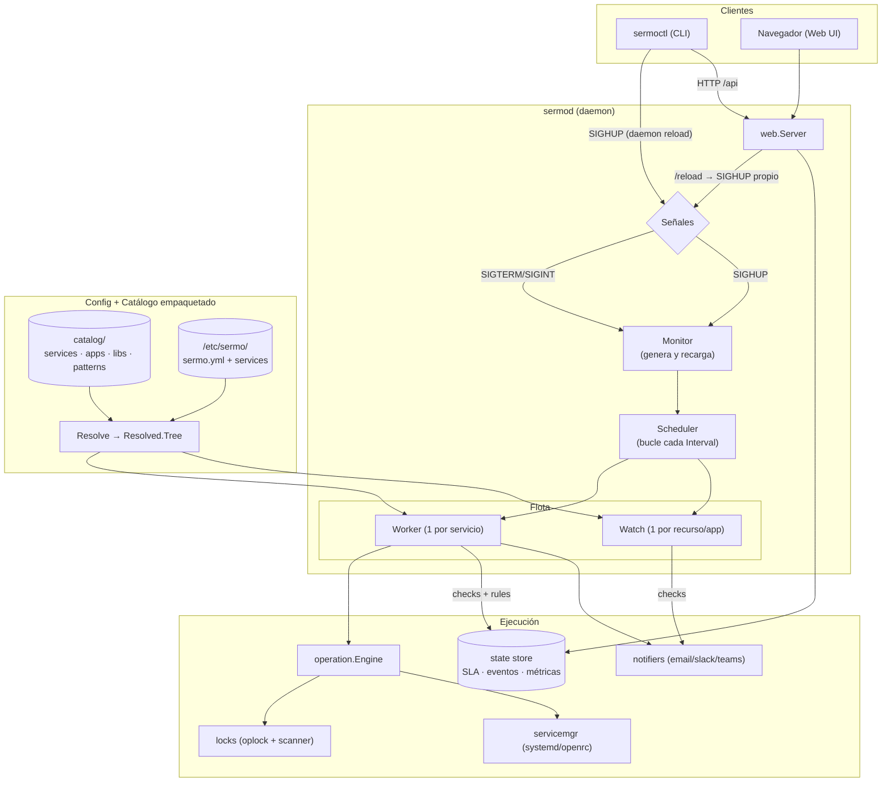
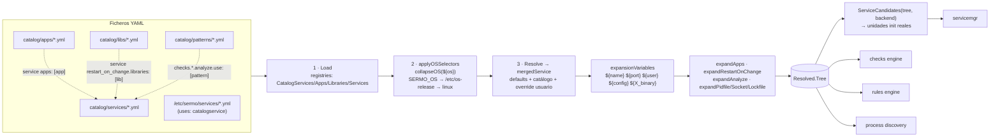
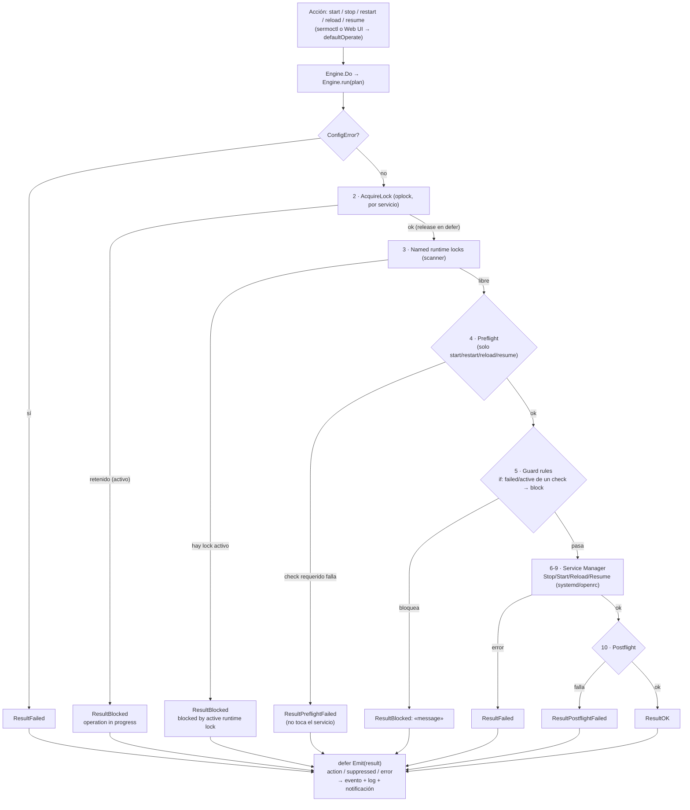
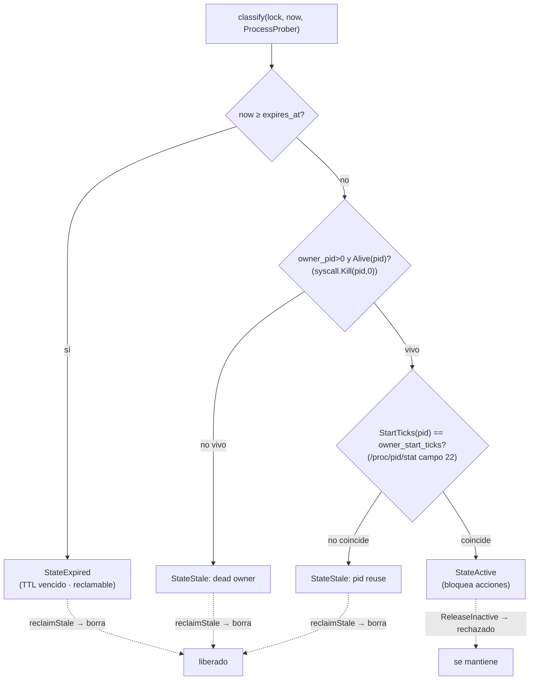
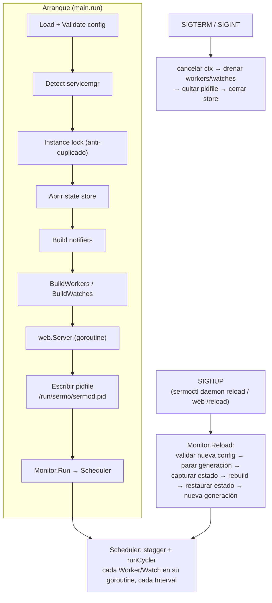
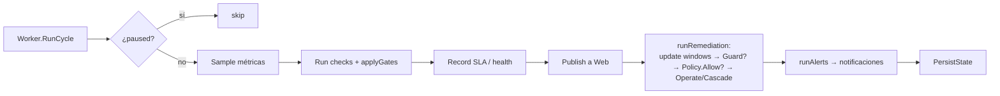

# Arquitectura de Sermo

Este documento describe, con diagramas, cómo funciona Sermo de extremo a
extremo: el daemon y sus señales, la resolución del catálogo, el pipeline de una
operación (con preflight, guards y locks), los estados de los locks y el ciclo
de monitorización.

Los diagramas son fieles al código; los ficheros y funciones ancla se citan al
final de cada sección para mantenerlos sincronizados.

---

## 1. Arquitectura general

Un único daemon (`sermod`) carga la configuración y el catálogo, construye una
**flota** de *Workers* (uno por servicio) y *Watches* (uno por recurso de host o
app), y los ejecuta en bucle. El CLI (`sermoctl`) y la Web UI hablan con el
daemon vía HTTP y señales. Las acciones sobre servicios pasan siempre por
`operation.Engine`, que coordina locks, preflight, guards y el gestor de init.

> Anclas: `cmd/sermod/main.go`, `internal/app/monitor.go`,
> `internal/app/scheduler.go`, `internal/app/worker.go`, `internal/app/watch.go`.

---

## 2. Resolución del catálogo (services / apps / libs / patterns)

El catálogo empaquetado (cargado desde el directorio compilado en el binario) y
la config de usuario se combinan en tres etapas: **Load** (registra todos los
documentos), **applyOSSelectors** (colapsa los bloques `os:` según el SO
detectado) y **Resolve** (fusiona defaults + catálogo + override de usuario,
expande variables y secciones). El resultado es un `Resolved.Tree` plano que
consumen el gestor de init, los checks, las rules y el descubrimiento de
procesos.

**Composición:** un *service* enlaza *apps* con `apps: [..]` (fusiona su preflight
y variables), y puede enlazar reinicios a cambios de librerías o versiones de app con
`restart_on_change.libraries` / `restart_on_change.apps`; los *patterns* se referencian
en `checks.*.analyze.use: [..]` para parsear la salida de los checks.

**Selectores de SO:** `collapseOS` resuelve `os: { ubuntu: {...}, debian: {...},
default: {...} }` a cualquier profundidad. Ejemplo: en Ubuntu, la unidad systemd
de `dhcpd` se reescribe a `isc-dhcp-server`. El SO se detecta por `SERMO_OS` →
`ID=` de `/etc/os-release` → `linux`.

> Anclas: `internal/config/loader.go`, `internal/config/osselect.go`
> (`applyOSSelectors`/`collapseOS`), `internal/config/resolve.go`
> (`Resolve`/`mergedService`), `internal/config/model.go` (`ServiceCandidates`,
> `CategoryService`/`CategoryApp`/`CategoryLibrary`/`CategoryPatterns`).

---

## 3. Pipeline de una operación (preflight · guard · locks)

Toda acción sobre un servicio (`start`/`stop`/`restart`/`reload`/`resume`) entra
por `Engine.Do` y la orquesta `Engine.run`. El orden es estricto: se adquiere el
**lock de operación** (serializa por servicio), se comprueban los **named locks**
(trabajo externo en curso), se corre **preflight**, se evalúan los **guards** y
solo entonces se invoca al gestor de init; al final corre **postflight**. En
cualquier salida se emite el evento.

- **Lock de operación** (`oplock`): serializa start/stop/restart de un mismo
  servicio; si está retenido por otra operación activa, devuelve `ResultBlocked`.
- **Named locks**: representan trabajo externo (p.ej. un backup que tomó un lock
  con nombre). Mientras estén **activos** bloquean las acciones del servicio.
- **Preflight**: checks que deben pasar *antes* de tocar el servicio (p.ej.
  `dhcpd` valida su config con `preflight: { config: { type: command, ... } }`).
  Un fallo aborta sin ejecutar la acción.
- **Guard**: reglas `type: guard` con `blocks: [restart, start]` y una condición
  `if: { failed: { check: X } }`. Se evalúan **en el momento** (no en ventana)
  contra la caché de checks; la primera que dispara bloquea con su `message`.

> Anclas: `internal/operation/engine.go` (`Do`/`run`),
> `internal/operation/build.go` (`sectionRunner`, `guardClosure`),
> `internal/rules/eval.go` (`Guard`/`Evaluator.Eval`).

---

## 4. Estados de un lock (`classify`)

`classify` decide el estado de un lock en un orden fijo: primero el vencimiento
(TTL), luego la liveness del propietario y por último la detección de reuso de
PID (comparando los *start ticks* del proceso). Solo los locks **activos**
bloquean acciones; los **expired**/**stale** son reclamables.

**Tipos de lock:** `OperationLocker` (en `<RuntimeDir>/ops/`, serializa acciones),
`NamedLocker` (en `<RuntimeDir>/locks/`, `Hold`/`Pin`/`Release`/`ReleaseInactive`
para trabajo externo) y `Scanner` (lee y clasifica los locks para la UI y el
motor). El `ProcessProber` (interfaz `Alive`/`StartTicks`) abstrae el acceso a
`/proc` para detectar propietarios muertos y reuso de PID.

> Anclas: `internal/locks/lock.go` (`classify`, `ProcessProber`),
> `internal/locks/oplock.go`, `named.go`, `scanner.go`, `proc.go`.

---

## 5. Señales y ciclo de vida

El arranque carga config, detecta el gestor de init, abre el state store,
construye la flota, levanta el servidor web, escribe el pidfile y entra en el
bucle del `Scheduler`. **SIGHUP** (que envía `sermoctl daemon reload` o el
endpoint `/reload`) dispara una recarga sin parar el daemon: valida la nueva
config, captura el estado en curso, reconstruye la flota y lo restaura.
**SIGTERM/SIGINT** cancelan el contexto para un apagado ordenado.

> Anclas: `cmd/sermod/main.go` (arranque, handlers de señal),
> `internal/app/monitor.go` (`Reload`), `internal/app/scheduler.go` (`Run`).

---

## 6. Ciclo de un Worker (por servicio)

Cada Worker, en cada tick del intervalo, ejecuta sus checks, registra SLA/health,
publica el estado para la Web y evalúa las reglas: la **remediación** actualiza
las ventanas de todas las reglas y ejecuta la primera que dispara (sujeta a guard
y a la política de cooldown/backoff), y las **alertas** notifican. El primer
ciclo tras arrancar/recargar es solo de observación.

El mismo mecanismo de guard (`rules.Guard`) que protege el pipeline de operación
se aplica aquí antes de remediar. Los `checks` alimentan a la vez los
health-checks, el preflight/postflight y las condiciones de las reglas; los
notifiers son pluggables (email/slack/teams).

> Anclas: `internal/app/worker.go` (`RunCycle`, `runRemediation`, `runAlerts`),
> `internal/rules/eval.go` (`Guard`).
