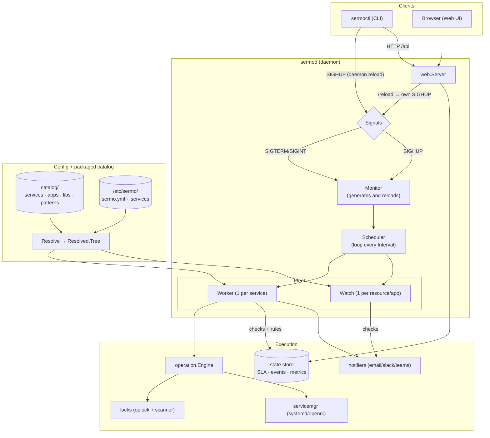
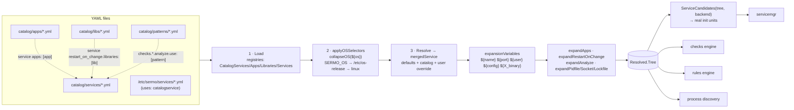
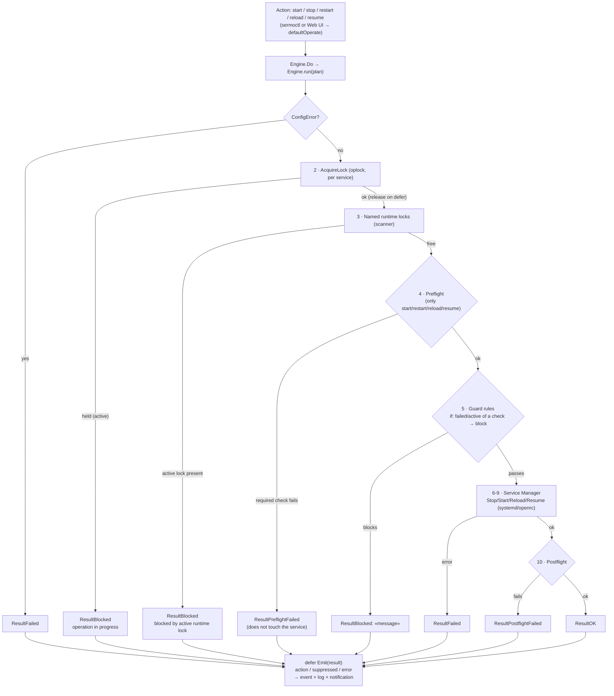
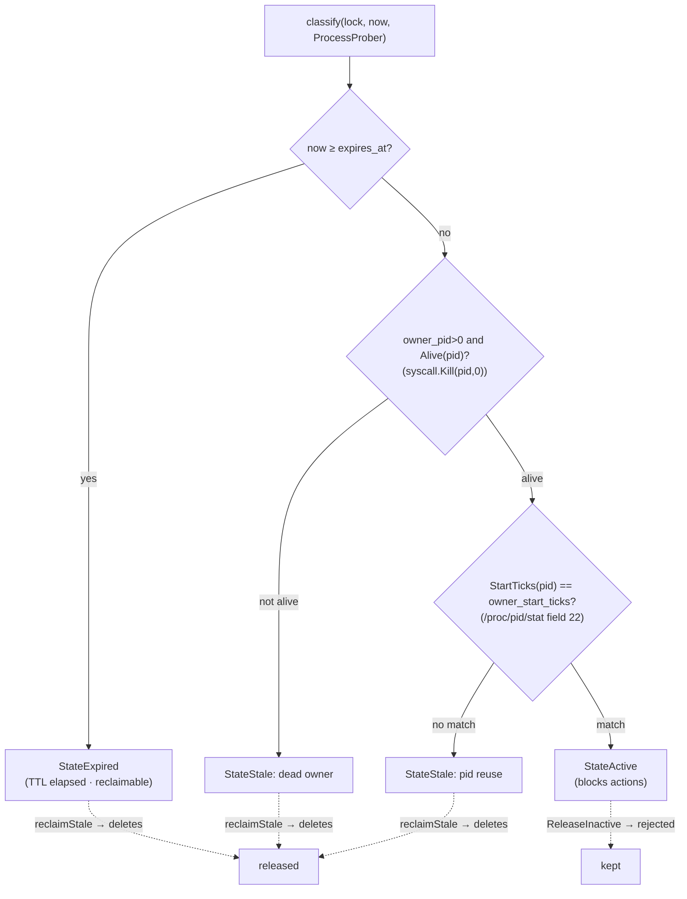
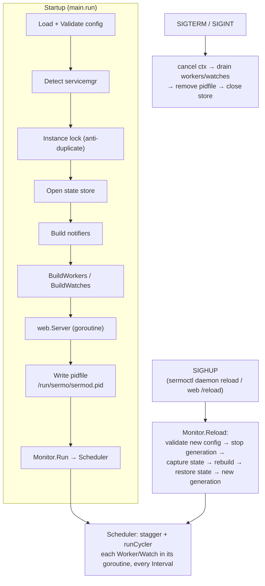
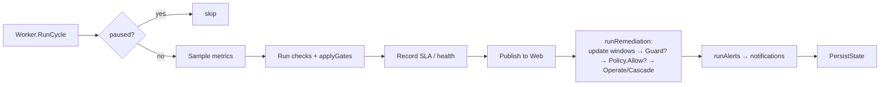

# Sermo Architecture

This document describes, with diagrams, how Sermo works end to end: the daemon
and its signals, catalog resolution, the pipeline of an operation (with
preflight, guards and locks), lock states and the monitoring cycle.

The diagrams are faithful to the code; the anchor files and functions are cited
at the end of each section to keep them in sync.

---

## 1. General architecture

A single daemon (`sermod`) loads the configuration and the catalog, builds a
**fleet** of *Workers* (one per service) and *Watches* (one per host or app
resource), and runs them in a loop. The CLI (`sermoctl`) and the Web UI talk to
the daemon over HTTP and signals. Service actions always go through
`operation.Engine`, which coordinates locks, preflight, guards and the init
manager.

> Anchors: `cmd/sermod/main.go`, `internal/app/monitor.go`,
> `internal/app/scheduler.go`, `internal/app/worker.go`, `internal/app/watch.go`.

---

## 2. Catalog resolution (services / apps / libs / patterns)

The packaged catalog (loaded from the directory compiled into the binary) and
the user config are combined in three stages: **Load** (registers every
document), **applyOSSelectors** (collapses the `os:` blocks according to the
detected OS) and **Resolve** (merges defaults + catalog + user override, expands
variables and sections). The result is a flat `Resolved.Tree` consumed by the
init manager, the checks, the rules and process discovery.

**Composition:** a *service* links *apps* with `apps: [..]` (merging their
preflight and variables), and can tie restarts to library changes or app
versions with `restart_on_change.libraries` / `restart_on_change.apps`;
*patterns* are referenced in `checks.*.analyze.use: [..]` to parse check output.

**OS selectors:** `collapseOS` resolves `os: { ubuntu: {...}, debian: {...},
default: {...} }` at any depth. Example: on Ubuntu, the systemd unit for `dhcpd`
is rewritten to `isc-dhcp-server`. The OS is detected from `SERMO_OS` → `ID=` in
`/etc/os-release` → `linux`.

> Anchors: `internal/config/loader.go`, `internal/config/osselect.go`
> (`applyOSSelectors`/`collapseOS`), `internal/config/resolve.go`
> (`Resolve`/`mergedService`), `internal/config/model.go` (`ServiceCandidates`,
> `CategoryService`/`CategoryApp`/`CategoryLibrary`/`CategoryPatterns`).

---

## 3. The pipeline of an operation (preflight · guard · locks)

Every action on a service (`start`/`stop`/`restart`/`reload`/`resume`) enters
through `Engine.Do` and is orchestrated by `Engine.run`. The order is strict:
the **operation lock** is acquired (serializes per service), the **named locks**
are checked (external work in progress), **preflight** runs, the **guards** are
evaluated and only then is the init manager invoked; at the end **postflight**
runs. On any exit path the event is emitted.

- **Operation lock** (`oplock`): serializes start/stop/restart of the same
  service; if it is held by another active operation, it returns `ResultBlocked`.
- **Named locks**: represent external work (e.g. a backup that took a named
  lock). While they are **active** they block the service's actions.
- **Preflight**: checks that must pass *before* touching the service (e.g.
  `dhcpd` validates its config with `preflight: { config: { type: command, ... } }`).
  A failure aborts without running the action.
- **Guard**: `type: guard` rules with `blocks: [restart, start]` and an
  `if: { failed: { check: X } }` condition. They are evaluated **at that moment**
  (not over a window) against the check cache; the first one that fires blocks
  with its `message`.

> Anchors: `internal/operation/engine.go` (`Do`/`run`),
> `internal/operation/build.go` (`sectionRunner`, `guardClosure`),
> `internal/rules/eval.go` (`Guard`/`Evaluator.Eval`).

---

## 4. Lock states (`classify`)

`classify` decides a lock's state in a fixed order: first expiry (TTL), then
owner liveness and finally PID-reuse detection (comparing the process's *start
ticks*). Only **active** locks block actions; **expired**/**stale** ones are
reclaimable.

**Lock types:** `OperationLocker` (in `<RuntimeDir>/ops/`, serializes actions),
`NamedLocker` (in `<RuntimeDir>/locks/`, `Hold`/`Pin`/`Release`/`ReleaseInactive`
for external work) and `Scanner` (reads and classifies locks for the UI and the
engine). The `ProcessProber` (interface `Alive`/`StartTicks`) abstracts access
to `/proc` to detect dead owners and PID reuse.

> Anchors: `internal/locks/lock.go` (`classify`, `ProcessProber`),
> `internal/locks/oplock.go`, `named.go`, `scanner.go`, `proc.go`.

---

## 5. Signals and lifecycle

Startup loads config, detects the init manager, opens the state store, builds
the fleet, brings up the web server, writes the pidfile and enters the
`Scheduler` loop. **SIGHUP** (sent by `sermoctl daemon reload` or the `/reload`
endpoint) triggers a reload without stopping the daemon: it validates the new
config, captures the in-flight state, rebuilds the fleet and restores it.
**SIGTERM/SIGINT** cancel the context for an orderly shutdown.

> Anchors: `cmd/sermod/main.go` (startup, signal handlers),
> `internal/app/monitor.go` (`Reload`), `internal/app/scheduler.go` (`Run`).

---

## 6. A Worker's cycle (per service)

Each Worker, on every interval tick, runs its checks, records SLA/health,
publishes the state for the Web and evaluates the rules: **remediation** updates
the windows of all rules and runs the first one that fires (subject to guard and
the cooldown/backoff policy), and **alerts** notify. The first cycle after
startup/reload is observation-only.

The same guard mechanism (`rules.Guard`) that protects the operation pipeline
applies here before remediating. The `checks` feed the health-checks, the
preflight/postflight and the rule conditions all at once; the notifiers are
pluggable (email/slack/teams).

> Anchors: `internal/app/worker.go` (`RunCycle`, `runRemediation`, `runAlerts`),
> `internal/rules/eval.go` (`Guard`).
